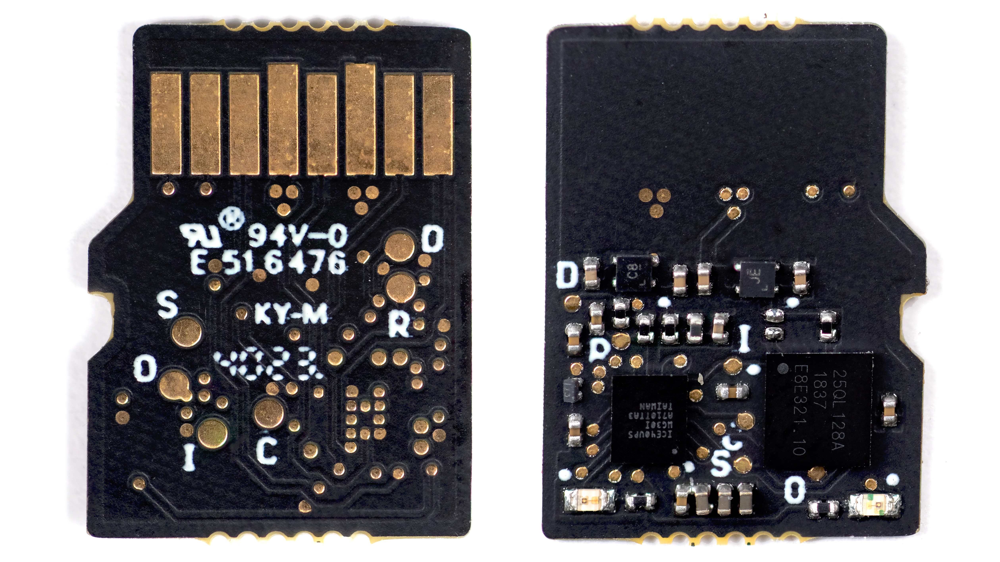
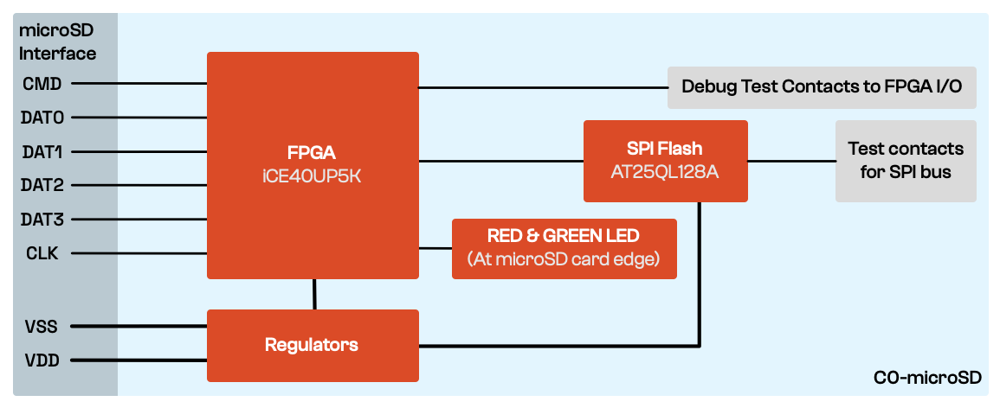

# Signaloid C0-microSD Hot-Pluggable Hardware Module
This repository contains Verilog design examples for use with the Signaloid C0-microSD hot-swappable hardware module. A companion repository for the hardware module's [bootloader utilities](https://github.com/signaloid/C0-microSD-utilities/), included as a submodule, contains utilities for interacting with the bootloader.

The **Signaloid C0-microSD** has two main use cases: You can either **(1) use it as a hot-pluggable co-processor module** (it implements a subset of Signaloid's C0 processor), or you can **(2) use it as a hot-pluggable FPGA module**. The Signaloid C0-microSD contains a bootloader that exposes the hardware module's functionality as a SD mass storage device, making it easy to configure new applications in either of the two use cases by performing I/O to the module when it is plugged into a host system. 



### Using the Signaloid C0-microSD as a hot-pluggable co-processor module
The Signaloid C0-microSD comes with a built-in version of Signaloid’s C0 RISC-V processor, which you can use to run your applications. In this mode of operation, host computers can use the SD protocol to exchange data with applications running on the Signaloid C0-microSD, either by creating custom applications that run on the host platform and which access the SD storage device, or using Unix tools such as `dd`. Applications running on the Signaloid’s C0 processor in the Signaloid C0-microSD, can take advantage of a subset of Signaloid’s [uncertainty-tracking technology](https://signaloid.com/technology) to quantify how uncertainties in data affect their outputs.

### Using the Signaloid C0-microSD as a hot-pluggable FPGA module
When using the Signaloid C0-microSD as a hot-pluggable FPGA module, you can plug it into your computer, load new FPGA bitstreams, and then either plug it into a breadboard using a microSD breakout board, or integrate it into a legacy (or custom) PCB that has an unused microSD slot. 

### How the Signaloid C0-microSD's bootloader works
The Signaloid C0-microSD detects whether it has been plugged in a SD host, and if so, presents itself as an unformatted block storage device. You can then write your custom bitstream to a specific offset (using tools such as `dd`) and its built-in bootloader will setup your bitstream so that it is the design that is configured into the FPGA after the system is power cycled. If the Signaloid C0-microSD is powered up but does not detect an SD host, it loads the last custom bitstream written to it in this way.

## Cloning the Repository 
The correct way to clone this repository is:
```
git clone --recursive git@github.com:signaloid/C0-microSD-hardware.git
```
To update all submodules
```
git pull --recurse-submodules
git submodule update --remote --recursive
```
If you forgot to clone with `--recursive`, and end up with empty submodule directories, you can remedy this with
```
git submodule update --init --recursive
```

## Getting Started 
### Install the Open-Source Software toolchain
This project requires the following open-source CAD tools:
- [icestorm](https://github.com/YosysHQ/icestorm)
- [nextpnr](https://github.com/YosysHQ/nextpnr)
- [yosys](https://github.com/YosysHQ/yosys)

For pre-compiled binaries of the open-source CAD toolchain, see https://github.com/YosysHQ/oss-cad-suite-build. You can also find two pre-compiled example bitstreams in the `bin/` directory of this repository.

### Synthesize and load examples
You can find example designs along with instructions on how to synthesize and load them to your device in the `examples/` directory of this repository.

## Features

- [ICE40UP5K](https://www.latticesemi.com/en/Products/FPGAandCPLD/iCE40UltraPlus) FPGA
  - 5280 logic cells
  - 128 Kbit (16 KB) dual-port Block RAM
  - 1 Mbit (128 KB) single-port RAM
  - One PLL, two SPI, and two I2C hard IPs
  - Two internal oscillators (10 kHz and 48 MHz)
  - 8 DSPs (16x16 multiply + 32-bit accumulate)
  - Hard IP PWM (for the on-board LEDs)
- [AT25QL128A](https://www.renesas.com/us/en/products/memory-logic/non-volatile-memory/spi-nor-flash/at25ql128a-128mbit-17v-minimum-spi-serial-flash-memory-dual-io-quad-io-and-qpi-support) SPI Flash
  - 128 Mbit (16 MB) non-volatile memory
  - 50 MHz typical operating frequency
  - 133 MHz maximum operating frequency (fast read)
  - Low power dissipation
- Programmable I/O pins
  - Two on-board leds (one red and one green), for status indication
  - Six programmable I/O pins (from the microSD interface)
  - Five additional programmable pins on test pads
- Built-in Signaloid C0 RISC-V processor
- Built-in bootloader, allowing you to load new FPGA bitstreams or RISC-V applications via the SD interface


## C0-microSD block diagram

