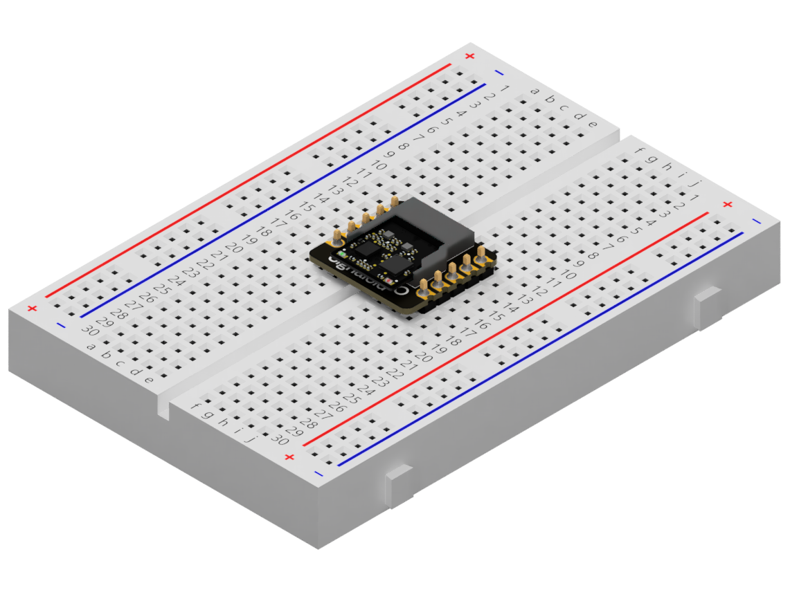

# Signaloid C0-microSD Hot-Pluggable Hardware Module

<iframe src="https://player.vimeo.com/video/1024723530?h=6ff0168018&amp;badge=0&amp;autopause=0&amp;player_id=0&amp;app_id=58479" frameborder="0" allow="autoplay; fullscreen; picture-in-picture; clipboard-write" style="position:absolute;top:0;left:0;width:100%;height:100%;" title="Signaloid C0-microSD CrowdSupply Campaign Video"></iframe>

The Signaloid C0-microSD is a low-power system-on-module (SoM) containing a Lattice iCE40 FPGA and 128Mbit of flash memory in a hot-swappable module that fits into a microSD slot. The FPGA is connected to the microSD interface pins, allowing developers to configure the C0-microSD to work as an SD-compatible device, accessed from a host computer or host embedded system via the 4-wire SD protocol or via the SD-over-SPI protocol. By taking advantage of the iCE40’s functionality for dynamic reconfiguration of the FPGA with multiple alternative images, the Signaloid C0-microSD SoM implements two key features that ease development. First, we provide a pre-built bootloader configuration as a default design in the FPGA, that lets developers use the SD interface to load their own custom FPGA bitstreams. Second, the bootloader also allows developers to switch between custom FPGA bitstreams and a pre-loaded RISC-V system-on-chip (SoC); the RISC-V SoC we provide implements a subset of Signaloid’s uncertainty-tracking technology and  can load programs from the flash built into the SoM.

|  |
|:--:|
| **Figure 1:** C0-microSD pinout diagram. |

## What The Signaloid C0-microSD System-On-Module is Useful For
The Signaloid C0-microSD has two main use cases: You can either **(1) use it as a hot-pluggable co-processor module**, or you can **(2) use it as a hot-pluggable FPGA module**. 

You can use it to prototype your designs on a breadboard using a microSD breakout board or integrate it into your new PCB designs by adding a dedicated microSD slot. You can even plug the Signaloid C0-microSD into an existing platform that supports microSD cards (like the Bee Data Logger or the Adafruit Adalogger) and use it as a co-processor.

|  |  |  |
|:--:| :--:| :--:|
| **Figure 2:** C0-microSD size comparison to US 1¢ coin. | **Figure 3:** C0-microSD connected to an SDDev board. | **Figure 4:** C0-microSD populating a breadboard using a microSD breakout board. |

Examples of current and possible use cases of the Signaloid C0-microSD SoM include:

1. Using Signaloid’s technology for performing deterministic arithmetic on probability distributions from legacy edge-of-the-network devices that have an unused microSD slot.
2. Bringing low-power FPGA hardware acceleration to embedded systems that are restricted from connecting to the cloud (e.g., certain factory floor PLCs) that have an unused microSD card slot.
3. Implementing bespoke hot-swappable cryptographic hardware that can be accessed from Unix as a block storage device, for use in laptops and other mobile devices with either a microSD or full-sized SD card slot that conforms to the full (4-wire) SD protocol.
4. Augmenting hobbyist or maker projects in Arduino-compatible hardware which have a microSD card slot accessed using the SD-over-SPI protocol.
5. Using the C0-microSD as a small and low-power microcontroller using the LiteX framework for embedded applications.

## Why We Created the Signaloid C0-microSD System-On-Module
We built the first prototype of the C0-microSD SoM in 2021 for use by a commercial partner with a use case around low-power data processing within an autonomous undersea vehicle (AUV) application and a subsea data sensor for monitoring offshore wind farm assets. The picture below shows the final AUV vehicle from that commercial engagement inside a testing tank (top half of picture) and the pressurized electronics container (bottom half of picure). You can see the old version of Signaloid’s logo (“S.“) on a banner inside the tank.

|  |
|:--:|
| **Figure 5:** The C0-microSD within the autonomous undersea vehicle (AUV). |

Our original prototype used the microSD form factor and interface method because several potential commercial partners needed a way to try out the different aspects of our technology without modifying their printed circuit boards to take a new custom integrated circuit or FPGA and ideally with minimal changes to their software. The microSD form factor and interface allowed these commercial partners to use our custom hardware module as a hot-swappable accelerator that plugged into an unused microSD card slot and where their firmware could easily use existing routines for interfacing to SD storage or SPI, to communicate with our accelerator module.

## How the Signaloid C0-microSD System-On-Module Works
The default mode of the Signaloid C0-microSD SoM is what we refer to as its **Bootloader** mode. In this mode, the red LED is lit and you can plug it into a host computer, at which point it will appear to your host PC as an unformatted 20MB storage device. 

Using open-source [tools we provide on GitHub](https://github.com/signaloid/C0-microSD-utilities/), you can load new FPGA bitstreams to the Signaloid C0-microSD SoM, load new RISC-V programs to be run by the built-in RISC-V SoC, or instruct the bootloader to switch between modes. 

When you switch the Signaloid C0-microSD SoM to **Signaloid SoC** mode, the green LED will now be lit. The device will still appear to your host PC as an unformatted 20MB storage device, but the Signaloid SoC will be loaded. You can use the open-source [libraries we provide on GitHub](https://github.com/signaloid/C0-microSD-utilities/) to create applications that interface with the Signaloid SoC via the SD interface. You can find more details on how to communicate with the  C0-microSD SoM while in Signaloid SoC mode in the [communication scheme section](/hardware-overview/signaloid-soc/communication-scheme).

|  |  |
|:--:| :--:| 
| **Figure 6:** C0-microSD in **Bootloader mode**. | **Figure 7:** C0-microSD in **Signaloid SoC mode**. |

You can find out more about switching between modes in the [mode guide section](/guides/switch-c0-microsd-mode).

## Getting started with the C0-microSD
You can find example RTL designs, along with instructions on how to flash them [here](https://github.com/signaloid/C0-microSD-hardware). You can also find example applications for the built-in Signaloid SoC [here](https://github.com/signaloid?q=Signaloid-C0-microSD-Demo). In this documentation page, you will find information on how the different [modes of operation](/hardware-overview/modes-of-operation.html) of the C0-microSD work, as well as instructions on how to [perform commonly-needed operations](/guides/) like identifying, switching, and flashing your C0-microSD.

## Compatibility
For host controllers and adapters known to be compatible with the Signaloid C0-microSD SoM, please see [the compatibility section](/hardware-overview/compatibility.html).
